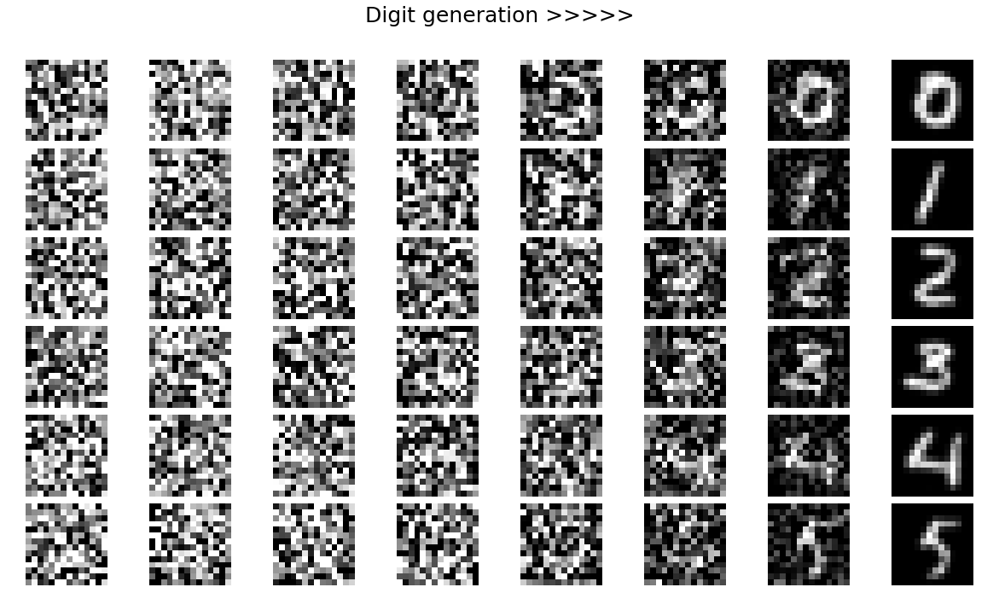

# Diffusion-sandbox
An experimental sandbox for implementing, testing, and visualizing diffusion models.

### 🔢 Digit diffusion

The figure below shows the reverse diffusion process on MNIST digits:  
each row corresponds to a target digit (0–5), and columns show samples
evolving from pure noise (left) to a clean digit (right).

  

