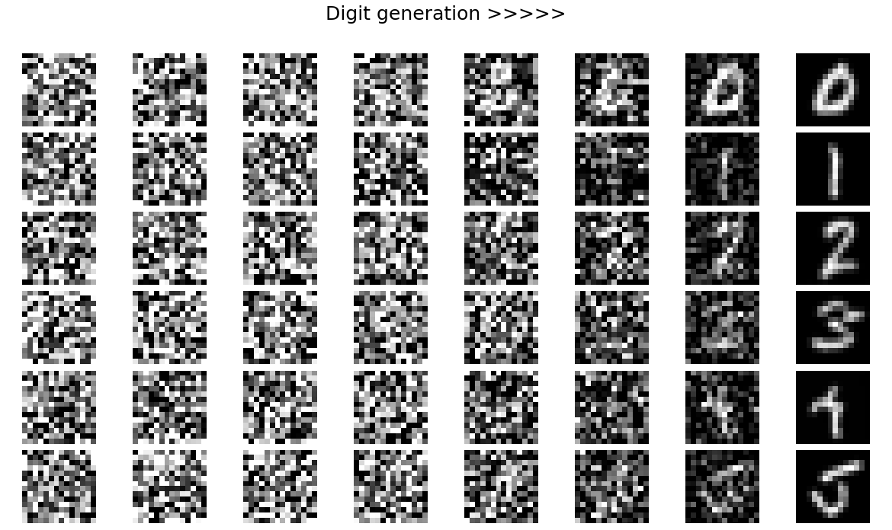

# Diffusion-sandbox
An experimental sandbox for implementing, testing, and visualizing diffusion models.

### 🔢 Digit diffusion

The figures below show the reverse diffusion process on MNIST digits:  
each row corresponds to a target digit (0–5), and columns show samples
evolving from pure noise (left) to a clean digit (right).

  

  

### 🎲 Dot → 🔢 digit diffusion 

This variant conditions the reverse diffusion process **only on a sparse “dot image”**:
an input canvas with *N* bright dots (single pixels), where *N* encodes the target class.
At inference time, I provide the dot image and the model denoises from pure noise into
a clean MNIST digit consistent with that dot-conditioning.

